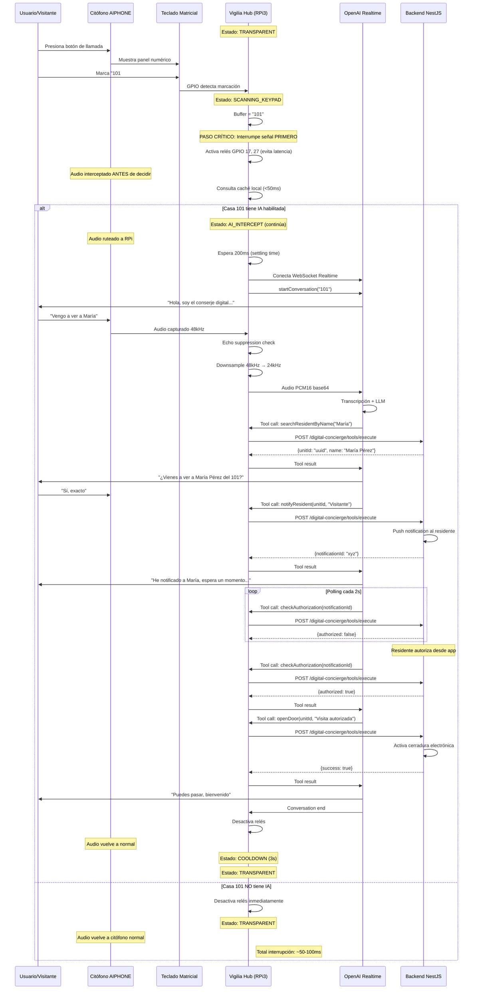
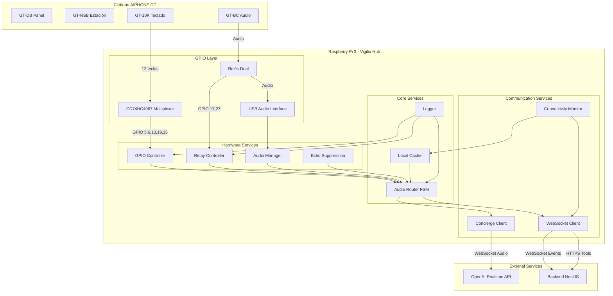
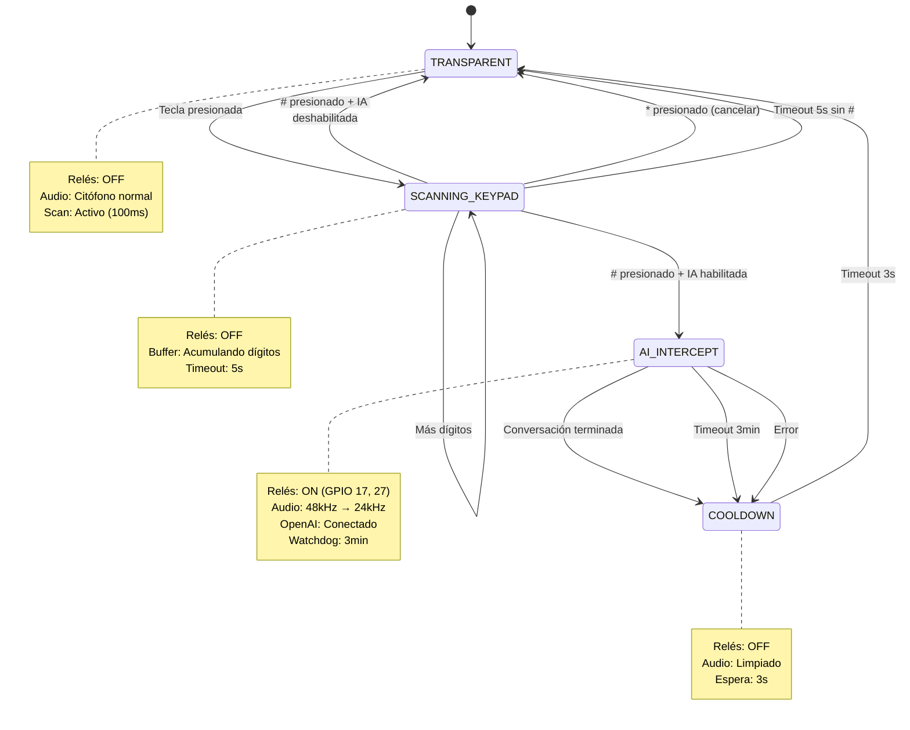
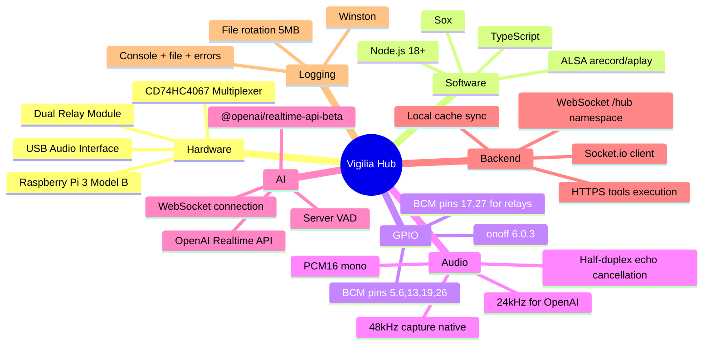

# Arquitectura del Sistema Vigilia Hub

## Diagrama de Secuencia - Flujo Completo



## Diagrama de Componentes



## Diagrama de Estados (FSM)



## Flujo de Audio

```mermaid
graph LR
    subgraph "Captura (Micrófono → OpenAI)"
        MIC[Micrófono citófono]
        RELAY1[Relé 1]
        USB1[USB Audio IN]
        AREC[arecord 48kHz]
        SOX[sox downsample]
        ECHO1[Echo Suppression]
        BASE64[Base64 encode]
        WS1[WebSocket]
    end

    subgraph "Reproducción (OpenAI → Bocina)"
        WS2[WebSocket]
        DECODE[Base64 decode]
        ECHO2[Echo notifier]
        APLAY[aplay 24kHz]
        USB2[USB Audio OUT]
        RELAY2[Relé 2]
        SPK[Bocina citófono]
    end

    MIC -->|Analog| RELAY1
    RELAY1 -->|ON: RPi| USB1
    USB1 -->|48kHz PCM16| AREC
    AREC -->|Raw| SOX
    SOX -->|24kHz PCM16| ECHO1
    ECHO1 -->|RMS > -45dB| BASE64
    BASE64 -->|Chunks| WS1
    WS1 -->|TLS| OPENAI[OpenAI API]

    OPENAI -->|TLS| WS2
    WS2 -->|Delta chunks| DECODE
    DECODE -->|24kHz PCM16| ECHO2
    ECHO2 -->|Notify active| APLAY
    APLAY -->|Raw| USB2
    USB2 -->|Analog| RELAY2
    RELAY2 -->|ON: RPi| SPK
```



## Arquitectura de Caché

```mermaid
graph TB
    subgraph "Decisión de Intercepción"
        KEY[Keypad: "101#"]
        DEC{Casa 101<br/>tiene IA?}
        CACHE[(Local Cache<br/>Map<string, bool>)]
        
        KEY --> DEC
        DEC -->|Consulta <50ms| CACHE
        CACHE -->|SÍ| AI[AI_INTERCEPT]
        CACHE -->|NO| TRANS[TRANSPARENT]
    end

    subgraph "Sincronización Backend"
        BACKEND[Backend NestJS]
        ENDPOINT[GET /units/ai-enabled]
        SYNC[Sync cada 5min]
        
        SYNC -->|HTTP + X-Hub-Secret| ENDPOINT
        ENDPOINT -->|JSON Array| BACKEND
        BACKEND -->|{houseNumber, hasAI}[]| CACHE
    end

    subgraph "Persistencia Local"
        DISK[(data/ai-units.json)]
        CACHE <-->|Load/Save| DISK
    end

    CACHE -.->|Sin red:<br/>Usa caché local| DEC
    BACKEND -.->|Conectividad OK| CACHE
```

## Stack Tecnológico



---

Generados con Mermaid.js para Vigilia Hub v1.0.0
